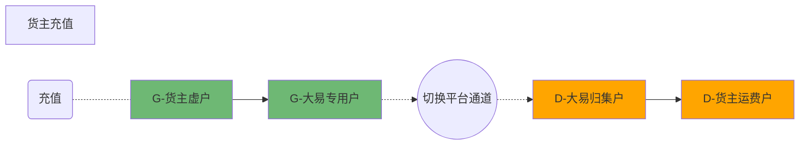
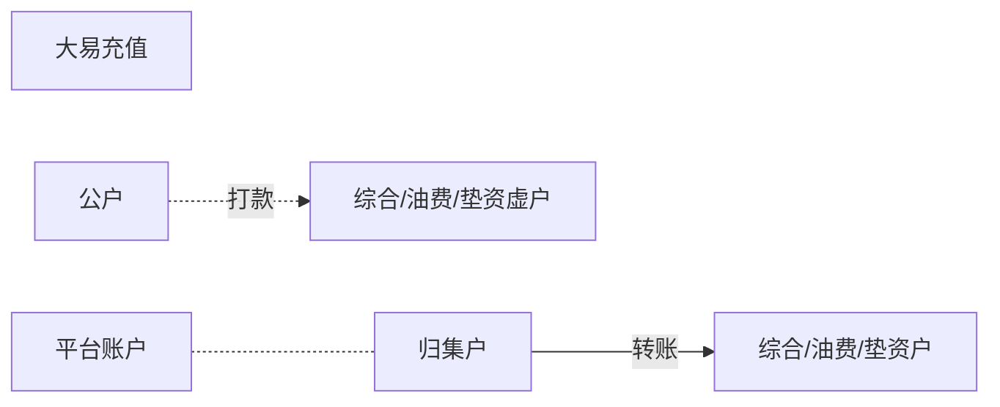

# 充值流程

## 概念
通道:
```
平安/光大/工行/平台

平安/光大/工行为真实的银行通道
平台为大易自建通道

结算通道: 每个开票方下会配置唯一的结算通道, 其中工行通道需要为货主单独配置
充值通道: 根据充值通道为货主创建通道下账户, 让货主可以入金
```

平台账户: 
```text
大易在平台内创建的账户数据, 实际的银行虚户在大易的映射, 一个平台账户可以包含多个银行下的虚户, 
一个平台账户的余额是它关联所有银行虚户的资金和
```

资金池: 
```text
客户的资金实际所在的一个虚户

货主资金池: 专用户, 平安/光大都会有专用户, 调拨任务会将非结算通道专用户的资金调拨到结算通道专用户
大易资金池: 大易实际类型的虚户(综合/垫资/油费)
司机/联盟油费: 油费专用户
司机/联盟/船东/铁路运费: 客户实际类型的虚户
油供应商油费: 易油宝虚户???  
```

资金调拨:
```text
用于支持充值, 结算不同通道的情况, 将非结算通道专用户的资金调拨到结算通道专用户

资金调拨是异步任务执行, 不涉及实际交易流程
```


归集户:
```text
平台账户的一个账户, 在平台账户需要入金或出金(非账户间转账)的场景, 交易对方为归集户
```

## 充值流程

### 货主充值


### 大易充值

