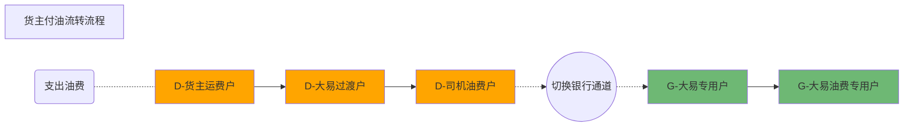
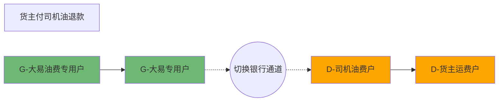
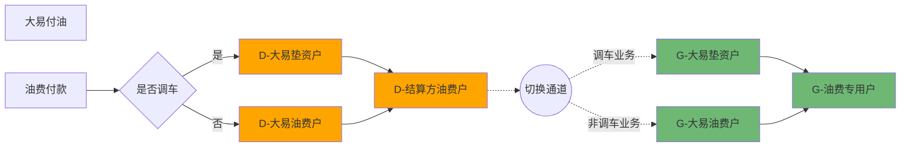
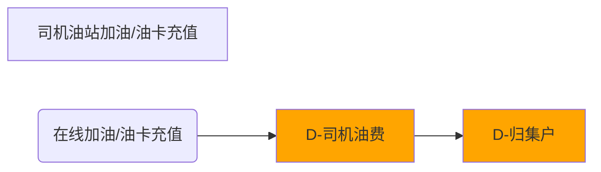
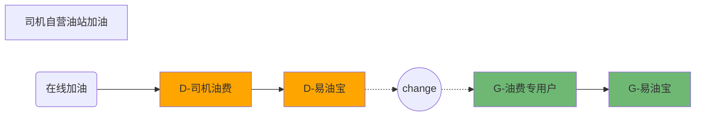
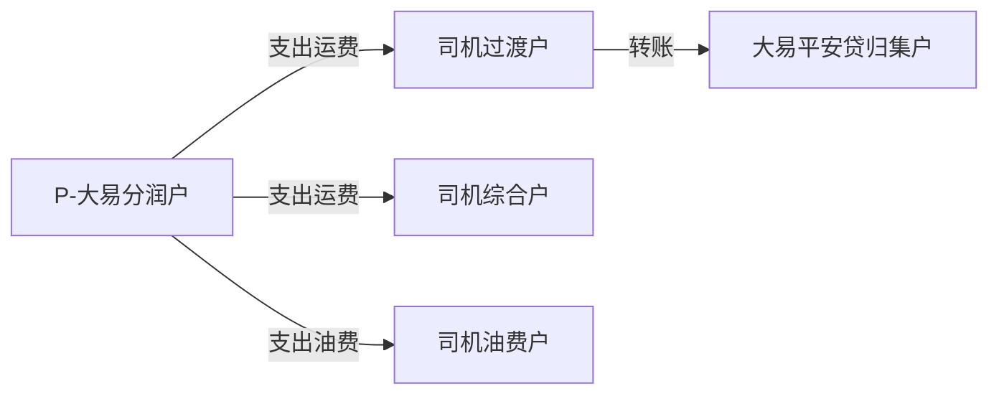
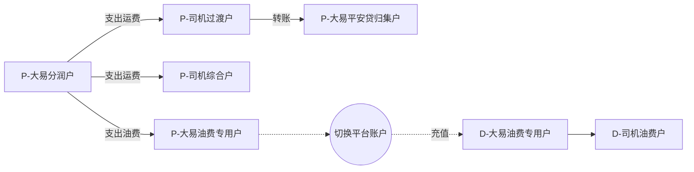
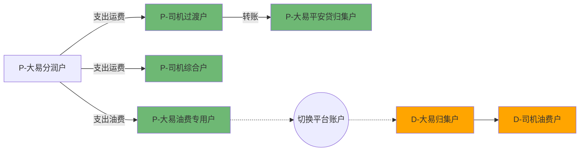

# 油费


### 油费场景

```markdown
1. 公司付司机/联盟油费
	调车业务下, 公司通过调车垫资账户付款,  否则通过油费账户付款(货主油费垫付)
	
	调车业务: CONSUME_OIL(-7, "支出油费") -- RECEIPT_OIL(4, "收入油费")
	非调车业务: ADVANCE_OIL(-4, "支出油费") -- RECEIPT_OIL(4, "收入油费")
	
	底层资金流程:
		平台: 公司油费/垫资 -> 司机/联盟油费
		银行: 公司油费/垫资 -> 油费专用户
	
2. 货主付司机/联盟油费
	
	CONSUME_OIL(-7, "支出油费") -- RECEIPT_OIL(4, "收入油费")
	
	底层资金流程:
		平台: 货主油费 -> 公司过渡 -> 司机/联盟油费
		银行: 公司专用户 -> 油费专用户

3. 联盟付司机油费

	CONSUME_OIL(-7, "支出油费") -- RECEIPT_OIL(4, "收入油费")
	
    底层资金流程:
		平台: 联盟油费 -> 司机油费
		银行: 无

	
4. 司机付公司油费
	司机在线加油
	
	CONSUME_OIL(-7, "支出油费") -- RECEIPT_OIL(4, "收入油费")
	
    底层资金流程:
		平台: 司机油费 -> 归集户
		银行:  无
	
5. 公司付供应商油费
	自营油站供应商, 付款流程第二步(第一步为 4. 司机在线加油)
	
	CONSUME_OIL(-7, "支出油费") -- RECEIPT_OIL(4, "收入油费")
   
   	底层资金流程:
		平台: 公司油费 -> 供应商油费
		银行: 无
	
ps: 供应商在实际提现时才发起资金到银行账户的流程处理
	
	
6. 平安融资分润-公司付司机/联盟油费 ????
	CONSUME_OIL(-7, "支出油费") -- RECEIPT_OIL(4, "收入油费")

   	底层资金流程:
		平台: 归集户 -> 司机油费户
		银行: 公司分润 -> 油费专用户
	
*油费如果有代收方, 收入类型为: RECEIVE_INTER_OIL(19, "代收油费")*

7. 油卡充值 - 司机/联盟付公司
	业务类型: 
		RECHARGE_OIL(-6, "支出油费")  -- RECEIPT_OIL(4, "收入油费")

   	底层资金流程:
		平台: 司机油费 -> 归集户
		银行: 无
	
8. 油卡充值撤销 - 公司付司机/联盟
	OIL_CANCEL(-9, "支出油费") -- OIL_RETREAT(7, "收入油费")

   	底层资金流程:
		平台: 归集户 -> 司机油费
		银行: 无

PS: 7, 8 为司机在线油卡充值/撤销, 油卡充值业务, BusinessStatement.oilCardNo 为油卡号; 在线加油业务, BusinessStatement.oilCardNo 为油站名称
*由于油费特殊性, 在资金进入油费专用户后, 除了退款的场景, 资金就不会再出来了, 所以油费业务流水不能表示实际资金变动*

账户资金:
	公司: 在独立垫资, 油费账户
	货主: 银行专用户
	司机/联盟油费: 在银行油费专用户
	司机/联盟运费: 在司机联盟各自运费户

纯平台账户场景:
	交易双方资金所在实际资金池一致时, 交易不触发银行请求, 比如联盟付司机

```


```markdown
油费退款:

1. 运力退款公司
	调车业务: 退款到调车垫资户
	非调车业务: 退款到油费户
	
	REFUNT_OIL_OUT(-13, "冲正扣款油费") -- REFUNT_OIL_IN(13, "冲正入账油费")
	
2. 运力退款货主
	REFUNT_OIL_OUT(-13, "冲正扣款油费") -- REFUNT_OIL_IN(13, "冲正入账油费")

3. 自营油站供应商退款公司
	REFUNT_OIL_OUT(-13, "冲正扣款油费") -- REFUNT_OIL_IN(13, "冲正入账油费")
	
4. 公司退款货主
	REFUNT_OIL_OUT(-13, "冲正扣款油费") -- REFUNT_OIL_IN(13, "冲正入账油费")
	
5. 公司退款司机
	REFUNT_OIL_OUT(-13, "冲正扣款油费") -- REFUNT_OIL_IN(13, "冲正入账油费")
	
6. 司机退款联盟
	REFUNT_OIL_OUT(-13, "冲正扣款油费") -- REFUNT_OIL_IN(13, "冲正入账油费")


```


### 货主支付
    假定结算通道为光大
    D- 平台账户
    G- 光大虚户
#### 支付    


#### 退款



### 大易油费授信付油

油费授信: 大易油费户(油费垫资) -- 司机油费
调车: 大易垫资户 -- 司机油费

*大易油费账户有自建, 但是金额与实际油费账户不联动*



### 司机加油

#### 司机非自营油站加油/油卡充值




#### 自营油站加油


### 大易结算油供应商油费 


### 供应商油费提现


### 平安融资油费

#### 平安融资分润前流程


#### *平安融资流程-纯平安账户版*




#### *平安融资流程-自建油费账户版*




#### 平安融资流程-大易自建账户版




## 司机商城付款


