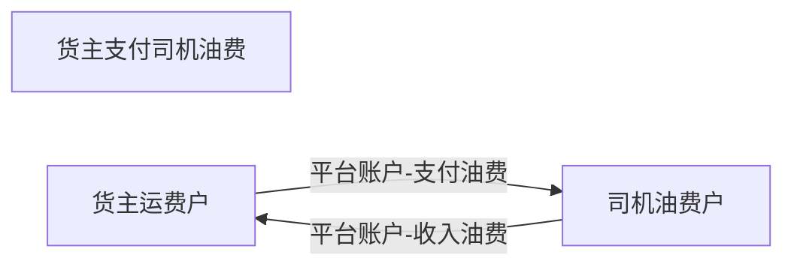
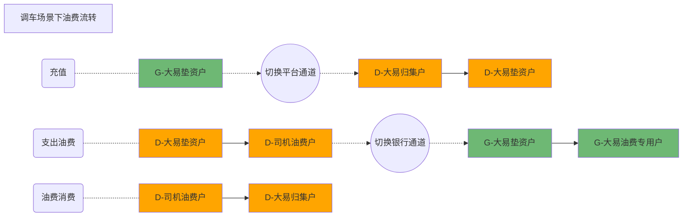

# 资金流程

## 标识


## 货主

### 货主充值

#### 业务流水


#### 资金流程


### 货主支付运费

#### 业务流水


#### 资金流程


### 货主支付油费

#### 业务流水




#### 资金流程


## 大易母公司


### 大易垫资充值

#### 业务流水


#### 资金流程


### 大易调车付司机运费

#### 业务流水


#### 资金流水


### 油费流转流程


#### 货主工行

```
工行不存在真实账户，只有一个主体账户，需要依托自建账户来管理所有账户
```


#### 调车场景




## 返现金


## 油费
[油费](./油费.md)


## 全流程图


