## 流程图

### 定义流程图
    Instead of flowchart one can also use graph.

    Possible FlowChart orientations are:
        TB - Top to bottom
        TD - Top-down/ same as top to bottom
        BT - Bottom to top
        RL - Right to left
        LR - Left to right

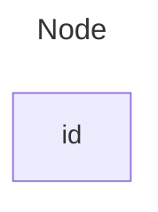

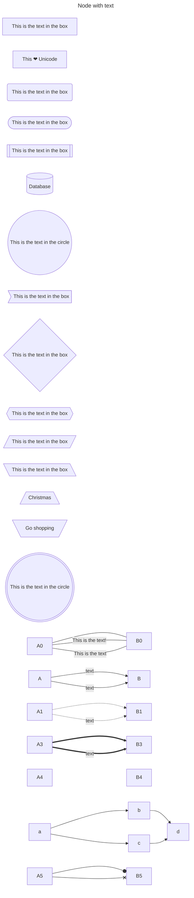

### Minimum length of a link
Each node in the flowchart is ultimately assigned to a rank in the rendered graph, i.e. to a vertical or horizontal level (depending on the flowchart orientation), based on the nodes to which it is linked. By default, links can span any number of ranks, but you can ask for any link to be longer than the others by adding extra dashes in the link definition.

In the following example, two extra dashes are added in the link from node B to node E, so that it spans two more ranks than regular links:
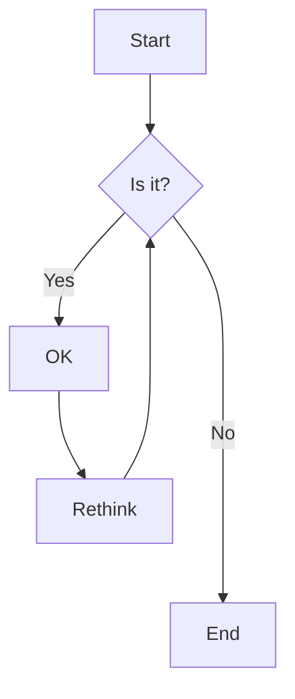

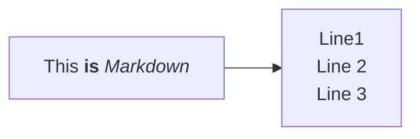

### Subgraphs
subgraph title
graph definition
end
An example below:

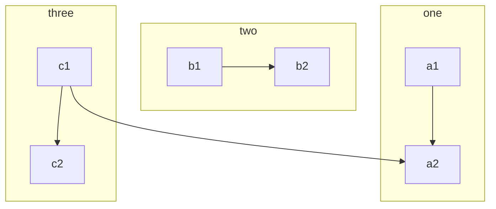

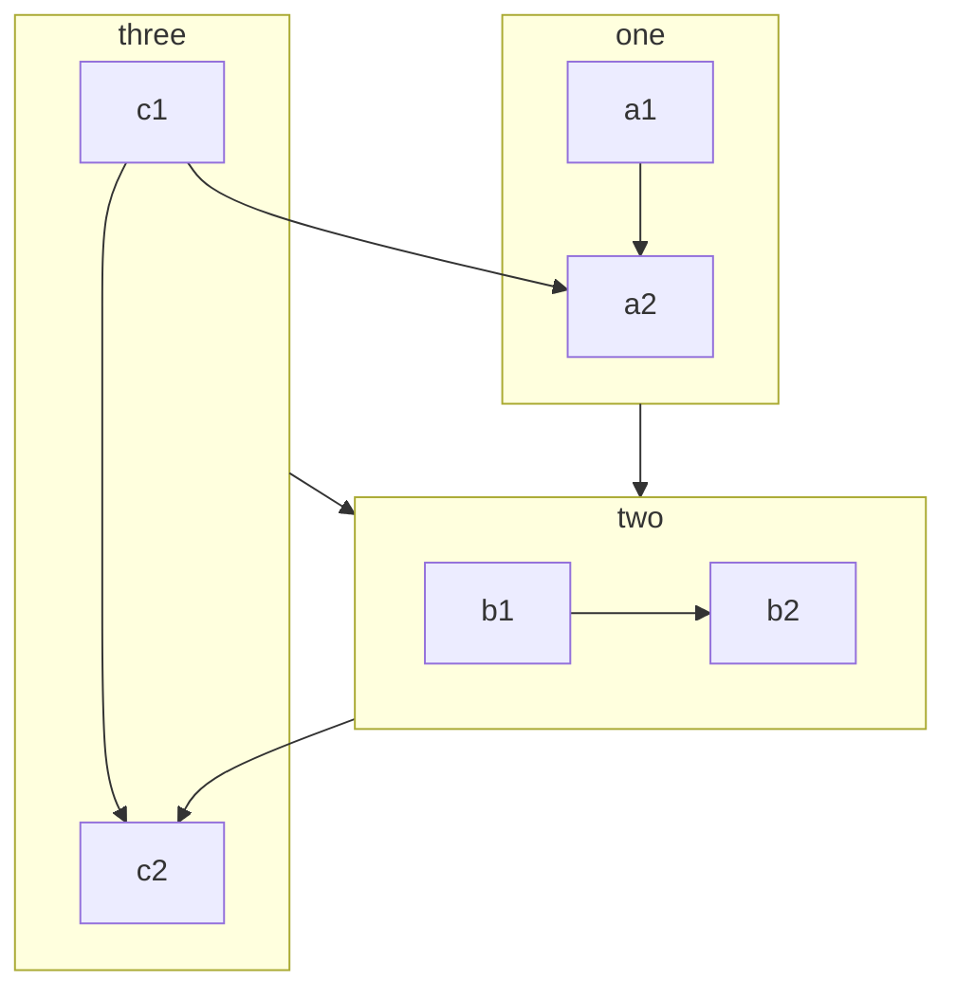

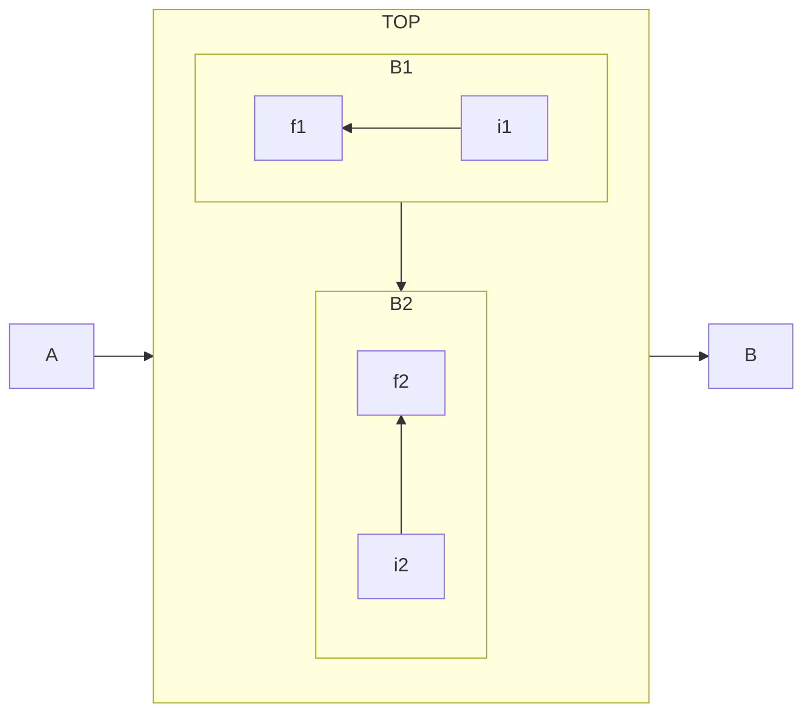

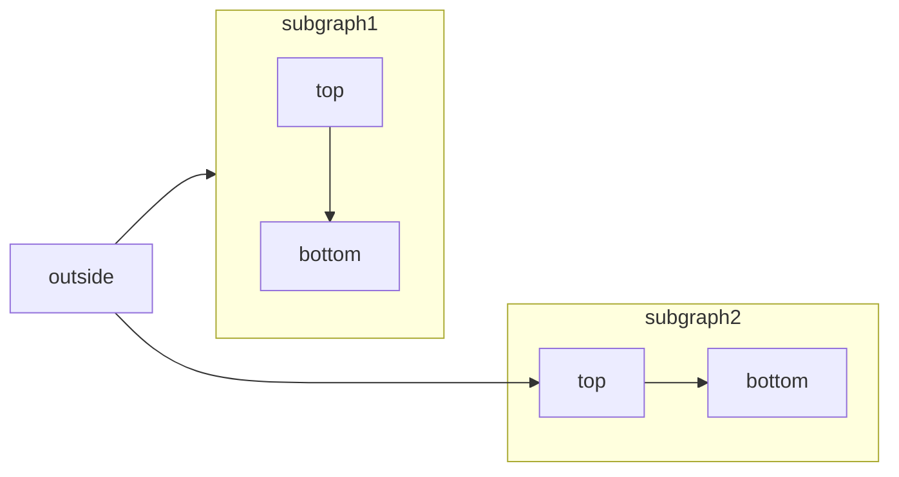

## Markdown Strings
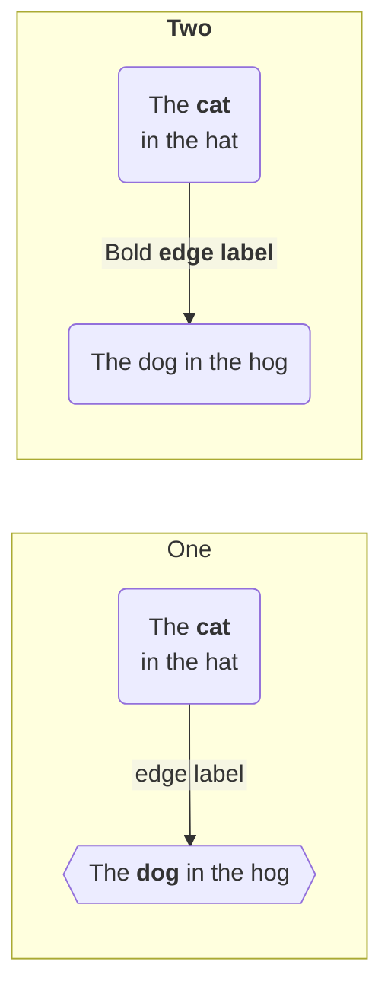

## State Diagram

### 并行的
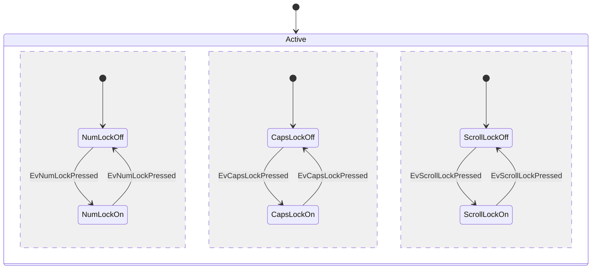

### 方向
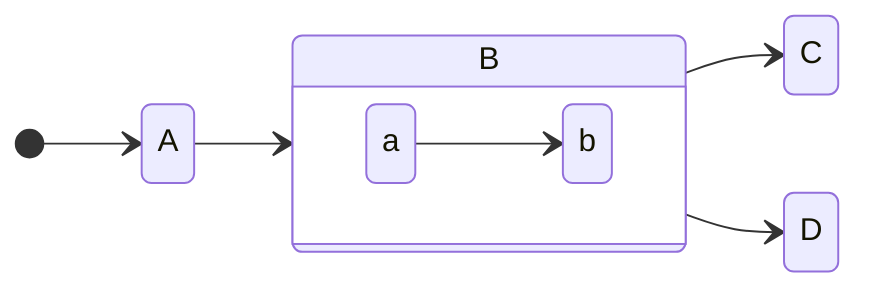

### 注释
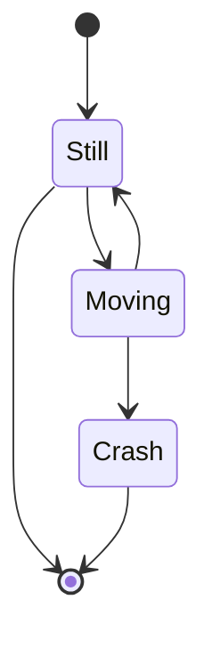

## 样式定义
### 通过class来引用样式

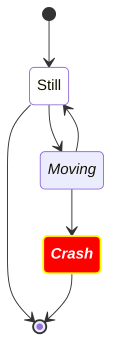

### 通过 ::: 来引用样式定义

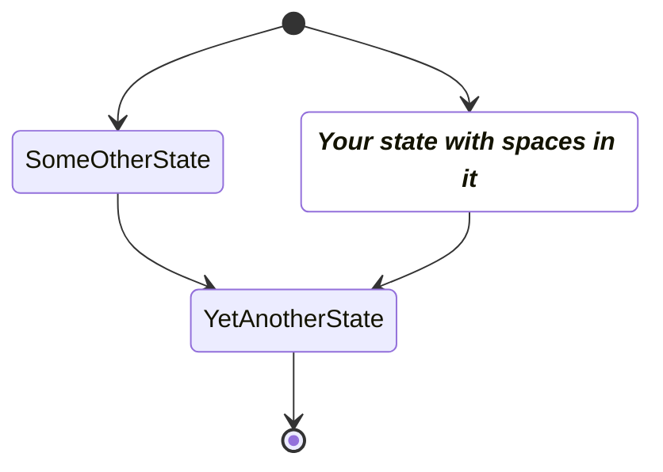